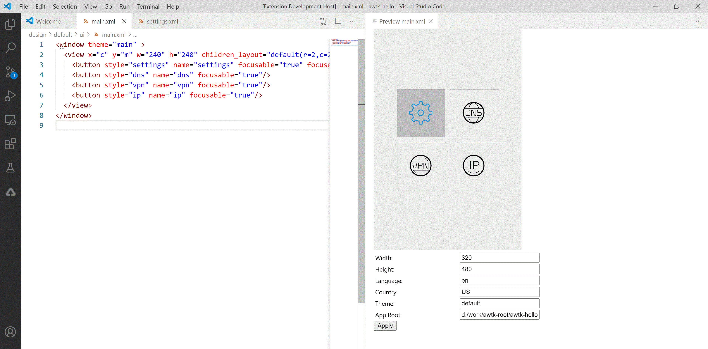

# awtk-previewer

AWTK 界面预览服务。

配合 [awtk-vscode-plugin](https://github.com/zlgopen/awtk-vscode-plugin) 实现在 vscode 中实现实时预览 AWTK XML UI 文件。




## 准备

1. 获取 awtk 并编译

```
git clone https://github.com/zlgopen/awtk.git
cd awtk; scons; cd -
```

2. 获取 awtk-restful-httpd 并编译
```
git clone https://github.com/zlgopen/awtk-restful-httpd.git
cd awtk-restful-httpd; scons; cd -
```

3. 获取 awtk-previewer 并编译
```
git clone https://github.com/zlgopen/awtk-previewer.git
cd awtk-previewer; scons
```

## 运行

> 考虑到 github 的下载速度，生成的临时资源没放到 git 中，需要自己生成资源：

```
./scripts/update_res.py all
```

```
bin/previewer
```

## 文档

